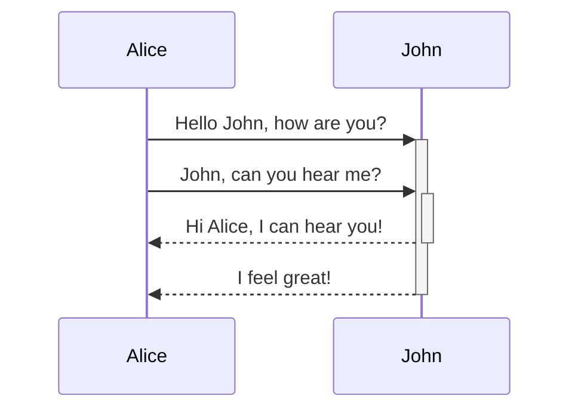

test&nbsp;


<SwmSnippet path="/PlayWrightAutomation/tests/ClientApp.spec.js" line="24">

---

Here we navigate through the cart and checkout process, select a country from a dropdown, submit the order, retrieve the order ID, and verify it against the order details in the user's order history.

```javascript
         break;
      }
   }

   await page.locator("[routerlink*='cart']").click();
   //await page.pause();

   await page.locator("div li").first().waitFor();
   const bool = await page.locator("h3:has-text('zara coat 3')").isVisible();
   expect(bool).toBeTruthy();
   await page.locator("text=Checkout").click();

   await page.locator("[placeholder*='Country']").pressSequentially("ind");
   const dropdown = page.locator(".ta-results");
   await dropdown.waitFor();
   const optionsCount = await dropdown.locator("button").count();
   for (let i = 0; i < optionsCount; ++i) {
      const text = await dropdown.locator("button").nth(i).textContent();
      if (text === " India") {
         await dropdown.locator("button").nth(i).click();
         break;
      }
   }

   expect(page.locator(".user__name [type='text']").first()).toHaveText(email);
   await page.locator(".action__submit").click();
   await expect(page.locator(".hero-primary")).toHaveText(" Thankyou for the order. ");
   const orderId = await page.locator(".em-spacer-1 .ng-star-inserted").textContent();
   console.log(orderId);

   await page.locator("button[routerlink*='myorders']").click();
   await page.locator("tbody").waitFor();
   const rows = await page.locator("tbody tr");


   for (let i = 0; i < await rows.count(); ++i) {
      const rowOrderId = await rows.nth(i).locator("th").textContent();
      if (orderId.includes(rowOrderId)) {
         await rows.nth(i).locator("button").first().click();
         break;
      }
   }
   const orderIdDetails = await page.locator(".col-text").textContent();
   expect(orderId.includes(orderIdDetails)).toBeTruthy();

});


```

---

</SwmSnippet>

&nbsp;

&nbsp;

<SwmMention uid="Z9Vnh2">[robert akopian](mailto:akopianrobert@gmail.com)</SwmMention>



<SwmToken path="/PlayWrightAutomation/allure-report/plugins/packages/index.js" pos="80:1:1" line-data="            testGroup: testGroup,">`testGroup`</SwmToken>

<SwmPath>[PlayWrightAutomation/](/PlayWrightAutomation/)</SwmPath>

&nbsp;

/

<SwmMeta version="3.0.0" repo-id="Z2l0aHViJTNBJTNBUUElM0ElM0Fyb2JTd2ltbQ==" repo-name="QA"><sup>Powered by [Swimm](https://app.swimm.io/)</sup></SwmMeta>
