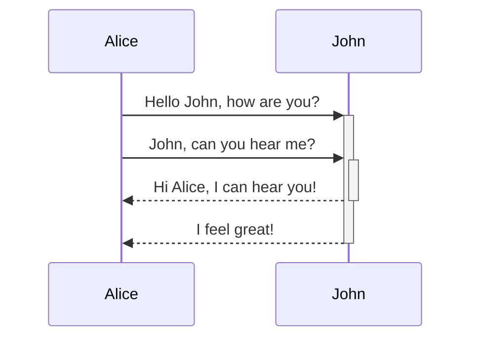

test code&nbsp;


<SwmSnippet path="/PlayWrightAutomation/tests/ClientApp.spec.js" line="6">

---

In this section, we focus on automating the entire login process for a client application. After successfully logging in, we will then navigate through the various sections of the app to reach the product page. Once we are on the product page, we will specifically look for and add a particular product, which is the ZARA COAT 3, to the shopping cart for the user.

```javascript
test('@Webst Client App login', async ({ page }) => {
   //js file- Login js, DashboardPage
   const email = "anshika@gmail.com";
   const productName = 'ZARA COAT 3';
   const products = page.locator(".card-body");
   await page.goto("https://rahulshettyacademy.com/client");
   await page.locator("#userEmail").fill(email);
   await page.locator("#userPassword").fill("Iamking@000");
   await page.locator("[value='Login']").click();
   await page.waitForLoadState('networkidle');
   await page.locator(".card-body b").first().waitFor();
   const titles = await page.locator(".card-body b").allTextContents();
   console.log(titles); 
   const count = await products.count();
   for (let i = 0; i < count; ++i) {
      if (await products.nth(i).locator("b").textContent() === productName) {
         //add to cart
         await products.nth(i).locator("text= Add To Cart").click();
         break;
      }
   }
```

---

</SwmSnippet>

&nbsp;

<SwmPath>[PlayWrightAutomation/tests/](/PlayWrightAutomation/tests/)</SwmPath>

<SwmToken path="/PlayWrightAutomation/pageobjects/LoginPage.js" pos="8:9:9" line-data="    this.password = page.locator(&quot;#userPassword&quot;);">`locator`</SwmToken>



&nbsp;

<p align="center"></p>

&nbsp;

# titile1

## t

### title3

#### titile 4

##### titile 5

###### titile 6&nbsp;

- 1
- 12
- 22
- 23

&nbsp;

1. 34
2. 34
3. 44

<SwmSnippet path="/PlayWrightAutomation/playwright.config1.js" line="1">

---

&nbsp;

```javascript
// @ts-check
const { devices } = require('@playwright/test');

const config = {
  testDir: './tests',
  retries :1,
  workers: 3,
  /* Maximum time one test can run for. */
  //10-
  timeout: 30 * 1000,
  expect: {
  
    timeout: 5000
  },
  
  reporter: 'html',
  projects : [
    {
      name : 'safari',
      use: {

        browserName : 'webkit',
        headless : true,
        screenshot : 'on',
        trace : 'on',//off,on 
        ...devices['iPhone 11'],    
      }

    },
    {
      name : 'chrome',
      use: {

        browserName : 'chromium',
        headless : false,
        screenshot : 'on',
        video: 'retain-on-failure',
        ignoreHttpsErrors:true,
        permissions:['geolocation'],
        
        trace : 'on',//off,on
       // ...devices['']
     //   viewport : {width:720,height:720}
         }

    }
    ]

};

module.exports = config;
```

---

</SwmSnippet>

<SwmMeta version="3.0.0" repo-id="Z2l0aHViJTNBJTNBUUElM0ElM0Fyb2JTd2ltbQ==" repo-name="QA"><sup>Powered by [Swimm](https://bosch-test.swimm.cloud/)</sup></SwmMeta>
